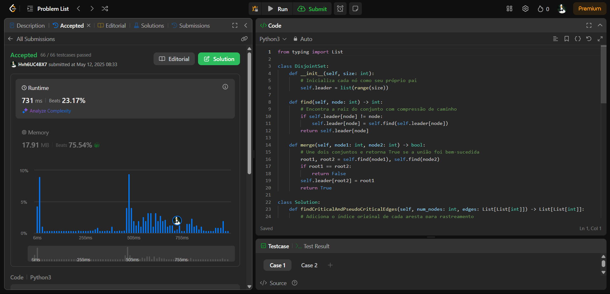
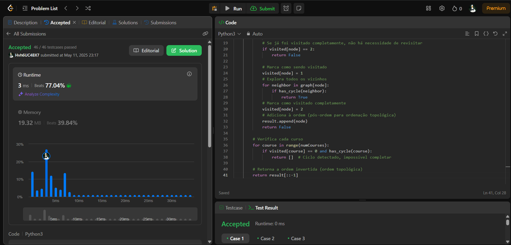
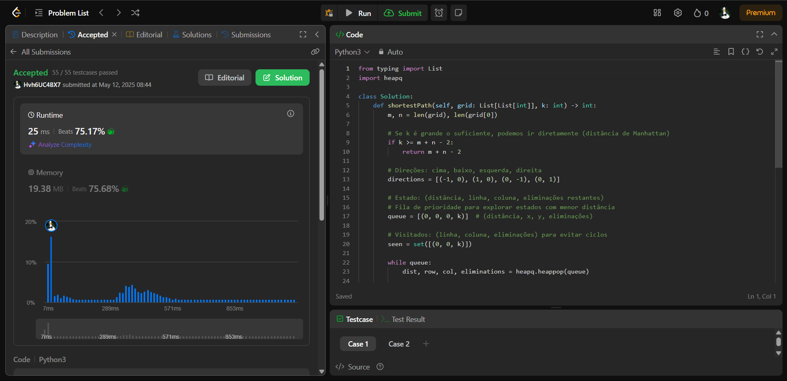

# Grafos2_leetcode

# Leetcode

**Número da Lista**: 1<br>
**Conteúdo da Disciplina**: Grafos 1 <br>

## Alunos
|Matrícula | Aluno |
| -- | -- |
| 21/1061897  |  Igor de Sousa Justino |
| 21/1061968  |  João Pedro Veras Gomes |

## Sobre 
O projeto consiste na resolução de questões que examinam o conteúdo visto na sala de aula sobre conceitos iniciais de gráficos

## Problema 1: [1489. Find Critical and Pseudo-Critical Edges in Minimum Spanning Tree](https://leetcode.com/problems/find-critical-and-pseudo-critical-edges-in-minimum-spanning-tree/)
- Nível: Difícil
- Implementação:[Código 1](https://github.com/IgorJustino/Grafos2_leetcode/blob/main/1489.%20Find%20Critical%20and%20Pseudo-Critical%20Edges%20in%20Minimum%20Spanning%20Tree)

**_._**
  

## Problema 2: [210. Course Schedule II](https://leetcode.com/problems/course-schedule-ii/description/)
- Nível: Médio
- Implementação:[Código 2](https://github.com/IgorJustino/Grafos2_leetcode/blob/main/210.%20Course%20Schedule%20II)

**_._**



## Problema 3: [1293. Shortest Path in a Grid with Obstacles Elimination](https://leetcode.com/problems/shortest-path-in-a-grid-with-obstacles-elimination/)
- Nível: Difícil
- Implementação:[Código 3](https://github.com/IgorJustino/Grafos2_leetcode/blob/main/1293.%20Shortest%20Path%20in%20a%20Grid%20with%20Obstacles%20Elimination)
  
**_._**



## Problema 4: [1584. Min Cost to Connect All Points](https://leetcode.com/problems/min-cost-to-connect-all-points/description/)
- Nível: Difícil
- Implementação:[Código 4](https://github.com/IgorJustino/Grafos2_leetcode/blob/main/1584.%20Min%20Cost%20to%20Connect%20All%20Points)

**_._**


## Instalação 
**Linguagem**:Python3 <br>
**Framework**: _(Nenhum)_ <br>

## Uso
Não é necessário compilador, apenas o interpretador Python 3. Para executar o arquivo `script1.py`:

```
$ python3 script1.py
```


